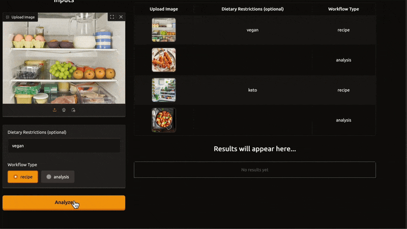

# 🥗 Agentic Nutritionist

Agentic Nutritionist is an advanced AI-powered application designed to provide personalized nutrition advice and planning using agent-based architectures and multimodal large language models (LLMs). This project integrates various AI tools, leverages YAML-driven agent/task creation, and is architected for flexibility and extensibility in the evolving landscape of AI health assistants.


---

## 📚 Table of Contents

- [Project Overview](#project-overview)
- [Key Tools and Technologies](#key-tools-and-technologies)
- [YAML-driven Agent & Task Configuration](#yaml-driven-agent--task-configuration)
- [Role of Multimodal LLMs](#role-of-multimodal-llms)
- [How it Works](#how-it-works)
- [Architecture](#architecture)
- [Getting Started](#getting-started)

---

## 📝 Project Overview

Agentic Nutritionist aims to bridge the gap between users and intelligent nutrition planning by harnessing AI agents and multimodal LLMs. The system allows users to interact via text, images (such as meal photos or nutrition labels), and structured data. It is flexible enough for researchers, developers, and end-users wanting evidence-based, adaptive nutrition guidance.

---

## 🛠️ Key Tools and Technologies

- **Python** 🐍: Core programming language for logic and pipeline orchestration.
- **Multimodal LLMs** 🤖🖼️: Enables understanding and reasoning over both text and images (e.g., OpenAI GPT-4V, CLIP, LLaVA, etc.).
- **YAML** 📄: Used for agent and task configuration, enabling no-code/low-code extensibility.
- **Gradio** 🚀: For UI.
- **Other AI/ML Libraries**: Such as `transformers`, `PIL` for image processing, and `pydantic` for data validation.
- **Docker** 🐳: For containerized deployment.
- _Add any other tools/libraries specific to your implementation here!_

---

## 📄 YAML-driven Agent & Task Configuration

A unique aspect of this project is the use of YAML files to declaratively define agents and tasks. This approach allows you to:

- **Create new agents** with specific roles (e.g., Diet Planner, Food Analyzer, Health Tracker) by simply editing or adding new YAML files.
- **Define tasks** (e.g., "Analyze meal photo", "Suggest daily nutrition", "Track macro intake") in a modular way, linked to specific agent capabilities.
- **Parameterize agent behavior** without touching the core codebase, enabling rapid prototyping and collaboration.
- **Example YAML Structure:**
    ```yaml
    agents:
      - name: FoodAnalyzer
        description: Analyzes food images and extracts nutritional information.
        tasks:
          - analyze_image
          - estimate_calories

    tasks:
      - name: analyze_image
        input: image
        output: nutrition_facts
    ```

---

## 🧠 Role of Multimodal LLMs

Multimodal LLMs are central to Agentic Nutritionist, enabling the system to:

- **Process and interpret images** (e.g., meal photos, nutrition labels) alongside textual inputs for richer understanding.
- **Generate context-aware, personalized nutrition advice** by combining visual and textual data.
- **Enable advanced tasks** such as food recognition, portion estimation, and personalized meal planning based on user preferences and dietary restrictions.
- **Seamlessly integrate agent behaviors** with LLM outputs for end-to-end automation.

---

## ⚙️ How it Works

1. **User Input**: Users can provide queries via text and/or upload images.
2. **Agent Selection**: Based on the YAML configuration, the appropriate agent(s) are invoked for the task.
3. **Task Execution**: The selected agent processes the input, possibly involving LLMs for vision and language understanding.
4. **Response Generation**: Results are aggregated and presented to the user in a user-friendly format.
5. **Extensibility**: New agents or tasks can be added by updating the YAML files—no code changes required.

---

## 🏗️ Architecture


- **Agent Layer**: Defined by YAML, encapsulates task logic and LLM interaction.
- **Task Orchestration**: Maps user requests to agents and tasks.
- **Multimodal Processing**: Utilizes LLMs for both vision and text understanding.
- **API/UI Layer**: Interfaces for user interaction.

---

## 🚀 Getting Started

1. **Clone the repository:**
    ```bash
    git clone https://github.com/Saranraj-k/Agentic_Nutritionist.git
    cd Agentic_Nutritionist
    ```

2. **Install dependencies:**
    ```bash
    pip install -r requirements.txt
    ```

3. **Configure agents and tasks:**
    - Edit the `agents.yaml` and `tasks.yaml` files as needed.

4. **Run the application:**
    ```bash
    python app.py
    # Or, if using Docker:
    docker compose up
    ```

---
